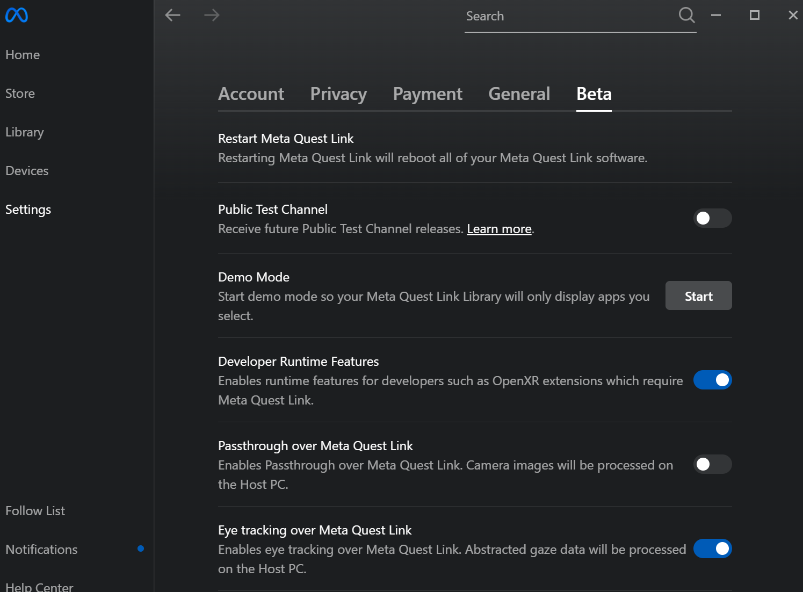

PTSD_VR Project    (Unity version: 2021.3.13f1)
===============================================

	config file is under Assets/StreamingAssets folder

	taskday controls task:
        (1)  day 1 - habituation, acquisition and questions
        rest
        (1)  after rest - extinction and questions
        (2)  day 2 - extinction and questions, habituation
 

- **Habituation** - Free walking where nothing happens, cycles through all 3 environments, using the `habituationTime` variable from the config file.
- **Acquisition** - Walk through the corridors, at the points specified on the config file by `acqStimpos`, the lights will change, user is expected to stop and wait. According to the `stimNumberAcquisition` list, where `n` stands for neutral and `f` for fear, spiders will jump on the user when the lights change in the fear conditions, otherwise there will be no change during the abnormal light. Then the lights go back to normal and the user is expected to resume walking.
- **Extinction** - It is the same as acquisition, but even in the fear conditions, there are no spiders, just light changes.

During walking, the user is expected to avoid wet floor signs to follow a very specific path.

The path loops, allowing the participant to continuously repeat the path as many times as necessary to fulfill all conditions specified on the `stimNumAcquisition` or `stimNumExtinction` lists in the config file.    

Usage Notes:
------------
### PC Controls

    Start Habituation: H

    Start Experiment (Acquisition/Extinction): Enter/Return
    
    Voting:
	Increase Rate: . or >  (no need to press shift)
	Decrease Rate: , or <  (no need to press shift)
	Confirm rate:	answer YES: Y
		        answer NO: N

### Headset Controls

    Start Experiment: BottomFaceButton(A/X) + UpperFaceButton(B/Y)

    Voting:
	Increase Rate: Grab slider by holding the trigger and move to right
	Decrease Rate: Grab slider by holding the trigger and move to left
	Confirm rate:   answer YES: BottomFaceButton or Reach on the YES box and press trigger when highlighted
		        answer NO: UpperFaceButton or Reach on the NO box and press trigger when highlighted

### Debugging
Debug Mode allows you to play on PC by enabling the joywalker (Walking speed is greatly increased)

    Enter debug mode: Ctrl+Space

	to move: W
	to look: mouse
	
    send mark: M
    neutral light: L
    negative light: Shift+L

-------------------------------------------------------------
Instructions to start
-------------------------------------------------------------

### How to set up Meta Quest Link

1. Download, install, and open Meta Quest Link (https://www.meta.com/quest/setup/?srsltid=AfmBOorWZ_fpW_fSsCHPtyQyCRNioeGJ70Xy2080zP7S5wzBSpTA42rS)
2. Log in with the same Meta account that is being used on the headset.
3. Select "Devices" on the left sidebar.
4. In the Devices page, click the "Add headset" button and then choose your headset from the list.
5. Pair your headset by following the instructions on both the PC screen and inside your headset. For wireless functionality, use the "AirLink" option during setup.
6. When the connection has been established on the PC, put on the headset.
7. Open the Quest's quick settings by selecting the clock on the main taskbar (lower-left).
8. Select "Link" and make sure the "Enable AirLink" checkbox is selected. If the headset paired properly to the PC, you should see your PC on the list below.
9. Select your PC from the list. This should open the Quest Link interface, which places you in a white-gridded room. The headset is now ready to be used for the task.

### How to install PTSD_VR

1. Download or clone project from: https://github.com/suthanalab/PTSDtaskVR_QP
2. Download, install, and open Unity Hub from: https://unity.com/download
3. In  the Projects page, click the "Add" dropdown option and select "Add project from disk".
4. Find and select the ROOT folder of the project. Note that the root folder is the one that contains the Assets, Packaging, and ProjectSettings folders. Sometimes the folder extracted from a ZIP file is one level above the root, and it only contains the actual root folder INSIDE of it.
5. The project should now show up in the Projects page of Unity Hub. Under Editor Version, follow the on-screen instructions to install version **2021.3.13f1**.
6. Click on the project name once (no double-click) when the installation is complete.
7. When the project opens, navigate to the desired scene (a-for Headset, b-for PC):  
	a. `PTSDtaskVR_QP\Assets\SuthanaLab\scenes\pilotSpiders.unity`  
	b. `PTSDtaskVR_QP\Assets\SuthanaLab\scenes\pilotSpidersPC.unity`  
8. Click on the Play button on the top center of the Unity editor window. If the headset is linked properly, the task should launch automatically in the headset. If the headset is not linked, the project can still be run in debug mode.

### Enabling Eye Tracking data 

NOTE: This only works with a Meta Quest Pro, otherwise the task also works on Quest 2 or Quest 3 without eye tracking.

1. The meta account being used needs to be a developer account. Follow the instructions on https://developers.facebook.com/docs/development/register/
2. On the Meta Quest Link PC app, click on "Settings" on the left sidebar. Being registered as a developer unlocks the "Beta" tab in the Settings. Navigate to it.
3. Enable "Developer Runtime Features"
4. Enable "Eye Tracking over Meta Quest Link"

